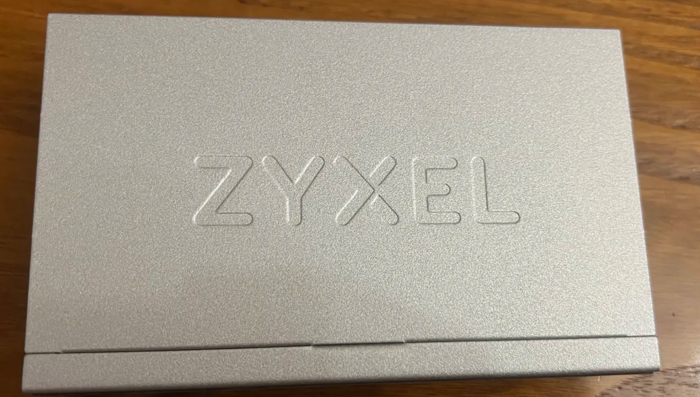
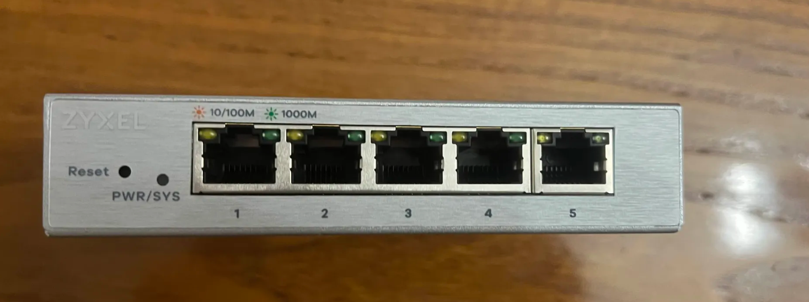

# Dispositivos

## Zyxel GS1200-5 — switch gerível

| Campo | Valor |
|---|---|
| Modelo | Zyxel GS1200-5 |
| Tipo | Switch gerível (smart managed) |
| Portas | 5× Gigabit Ethernet (RJ45) |
| Funções principais | VLANs, port mirroring, QoS, link aggregation, IGMP snooping |
| Papel no projeto | Switch central dos testes de segmentação e análise de tráfego |
| Posição na rede | Entre o Switch 2 e o Portátil 1 |

### Fotos

**Cima** — vista superior, mostrando o formato compacto do equipamento.

**Frente** — vista frontal com as 5 portas RJ45 e os LEDs de estado.

### Porquê este switch

O Zyxel GS1200-5 foi escolhido precisamente por ser gerível. Um switch
gerível permite configurar funcionalidades que um switch não-gerível
simplesmente não suporta:

| Funcionalidade | O que acrescenta |
|---|---|
| VLANs | Segmentar a rede em domínios isolados sem separar fisicamente |
| Port mirroring | Duplicar tráfego de uma porta para análise com Wireshark |
| QoS | Priorizar ou limitar largura de banda por porta ou tipo de tráfego |
| Link aggregation | Agregar duas ligações numa só |
| IGMP snooping | Controlar quem recebe tráfego multicast |

### Onde fica ligado

O Zyxel não substitui nenhum dos switches existentes — é inserido
**a seguir ao Switch 2**, entre este e o Portátil 1, sem alterar o Switch 1
nem a rede doméstica principal.

- **Porta 1 do Zyxel** → ligada ao Switch 2 (para cima)
- **Porta 2 do Zyxel** → ligada ao Portátil 1
- **Portas 3–5 do Zyxel** → livres
